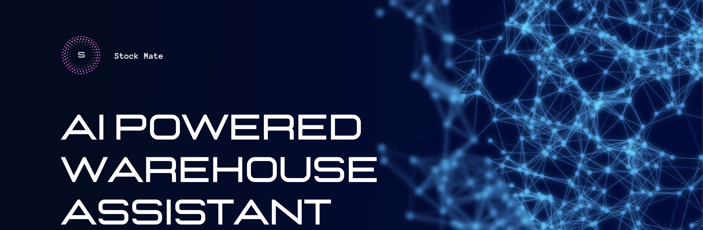
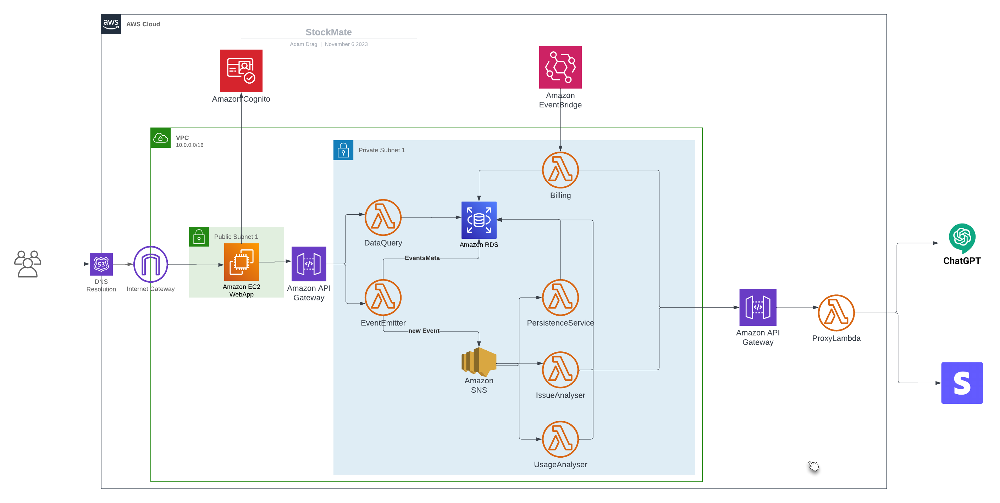

# Stock Mate

Welcome to **Stock-Mate**! This project is an exploration into building a flexible and event-driven system architecture on AWS. The primary goal is to have fun and learn by implementing various concepts, even if it means overengineering certain aspects. The system, currently hosted on AWS, utilizes Lambdas for event processing, leverages SNS for event delivery, and uses Amazon RDS for database management.

## Table of Contents

- [Development Approach](#development-approach)
- [System Architecture](#system-architecture)
- [Deployment and Technology Stack](#deployment-and-technology-stack)
- [Future Considerations](#future-considerations)
- [Development Environment](#development-environment)

## Development Approach

In designing this system, the primary focus is on personal learning and enjoyment rather than commercial use. The architecture may be perceived as overengineered, but the intention is to explore various concepts and technologies.

## System Architecture

The system adopts a semi-event-driven architecture where the state is persisted in events, allowing for reconstruction by replaying them. While the architecture is currently not purely event-driven, it provides highly decoupled system elements, facilitating collaborative development without conflicts.

A mono repository is utilized for development efficiency, but the code structure is designed to support future splitting into multiple component-focused repositories.

## Deployment and Technology Stack

- **Cloud Platform:** AWS
- **Event Processing:** AWS Lambdas
- **Event Delivery:** AWS Simple Notification Service (SNS)
- **Database:** Amazon RDS
  - Chosen for its suitability with a well-defined entity schema and complex relationships.
  - Consideration for future scalability, with a potential shift to DynamoDB if needed.

## Future Considerations
While the current architecture suits the project's needs, future considerations include exploring a more purely event-driven approach. Scalability concerns are acknowledged, and if they become critical, a transition to DynamoDB might be considered due to its low maintenance cost and efficient scalability handling by AWS. Additionally, for scenarios where guaranteed message delivery is crucial, moving to Amazon Simple Queue Service (SQS) could be explored, as it provides reliable and fault-tolerant message queuing with features designed to ensure message delivery.

## Development Environment

The project is currently managed in a mono repository, providing a streamlined development experience for the sole developer.

---

Thank you for exploring this project! If you have any questions, feedback, or would like to contribute, feel free to get in touch. Have a great day!

[Visit My Page](https://adam-drag.github.io/) to learn more about me and explore my development blog, where you'll find posts related to working on this project.

[Email Me](mailto:adam.drag@outlook.com)
